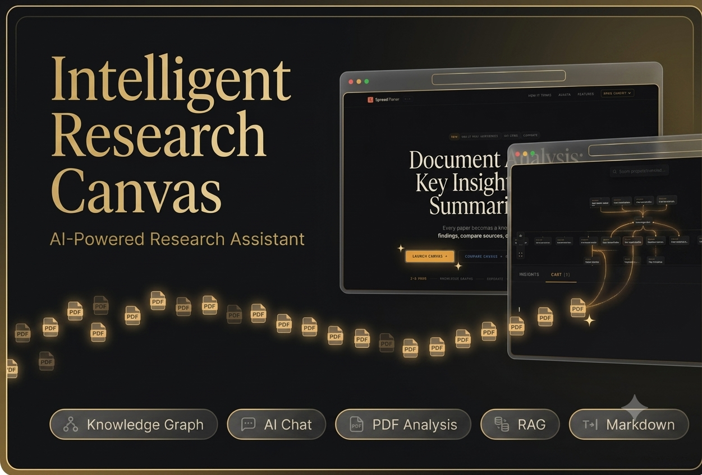

# Intelligent Research Canvas

Transform research PDFs into an interactive, AI-powered knowledge workspace.

Upload a paper, generate a typed knowledge graph and ranked insights, chat with the full document context, trace AI-generated outputs back to source quotations, and export the complete research session as structured LaTeX or Markdown.

Built with Next.js 15, TypeScript, Tailwind CSS v4, React Flow, Zustand, and Gemini 2.0 Flash.

> **Collaborative project:** This repository is owned and maintained by the project owner. Muhammad Hamdan Rauf contributed as a backend developer, focusing on Gemini API integration, AI-service connectivity, response handling, validation workflows, testing, and application integration.

---

## Table of Contents

- [Product Overview](#product-overview)
- [Product Demonstration](#product-demonstration)
- [Screenshots](#screenshots)
- [Core Features](#core-features)
- [How It Works](#how-it-works)
- [The Four AI Agents](#the-four-ai-agents)
- [System Architecture](#system-architecture)
- [Technology Stack](#technology-stack)
- [Quick Start](#quick-start)
- [Environment Variables](#environment-variables)
- [Application Routes](#application-routes)
- [Security and Privacy](#security-and-privacy)
- [Deployment](#deployment)
- [Project Structure](#project-structure)
- [Contributors](#contributors)
- [Project Status](#project-status)
- [Future Improvements](#future-improvements)
- [License](#license)

---

## Product Overview

Intelligent Research Canvas is an AI-powered research workspace designed to help users explore academic papers beyond ordinary PDF reading.

Instead of treating a research document as a static file, the application transforms it into an interactive workspace containing:

- A typed knowledge graph
- Ranked research insights
- Source-grounded AI chat
- Bidirectional document highlighting
- Structured LaTeX and Markdown exports

The platform helps researchers, students, analysts, and technical readers understand relationships between concepts, methods, findings, entities, and evidence contained within a paper.

The main workflow is:

```text
Upload PDF
    ↓
Extract Text
    ↓
Generate Knowledge Graph + Ranked Insights
    ↓
Explore Nodes and Source Quotations
    ↓
Chat with Document Context
    ↓
Export Structured Research Report
```

[Back to top](#table-of-contents)

---

## Product Demonstration

Watch the complete product demonstration:

[View the Intelligent Research Canvas Demo](https://drive.google.com/file/d/1DSqumO5qigTjrPbg35LI6wmdPJEdQzKe/view?usp=sharing)

A clickable thumbnail can also be used:

```markdown
[]
```

[Back to top](#table-of-contents)

---

## Core Features

### Browser-Based PDF Processing

Research PDFs are processed using `pdfjs-dist`.

PDF text extraction is performed locally in the browser. Extracted text required for graph generation, insight analysis, contextual chat, and report generation is then processed through the configured Gemini API.

### Interactive Knowledge Graph

The application converts research content into a graph containing typed nodes such as:

- Concepts
- Entities
- Methods
- Findings

The graph visually represents relationships between important elements in the paper.

Users can:

- Move and inspect nodes
- Explore concept relationships
- Select nodes to focus on specific evidence
- Connect graph elements with source quotations
- Use graph context during AI chat

### Ranked Research Insights

The Insight Analyzer generates exactly five ranked insights.

Each insight includes:

- Insight text
- Category
- Confidence
- Supporting context
- Relative importance

This helps users quickly identify the most significant parts of a research document.

### Bidirectional Source Highlighting

Selecting a graph node highlights the corresponding verbatim source quotation in the document.

This creates a bidirectional relationship between:

```text
Graph Concept
      ↕
Source Evidence
```

The feature improves traceability and helps users understand how AI-generated concepts relate to the original paper.

### Context-Grounded Chat

Users can ask questions about the uploaded research paper.

The chat system uses:

- Full document text
- Generated graph context
- Selected focus node
- Selected source quotation
- Prior conversation context

Responses are streamed to the interface and grounded in the uploaded research material.

### Structured Research Export

The application can export the complete session as:

- LaTeX
- Markdown

Generated reports can include:

- Abstract
- Main findings
- Concept map
- Ranked insights
- Research discussion
- Chat history
- Structured conclusions

[Back to top](#table-of-contents)

---

## How It Works

### Step 1: Upload a Research PDF

The user selects a PDF file through the browser interface.

### Step 2: Extract Document Text

`pdfjs-dist` extracts readable text from the document directly in the browser.

### Step 3: Run Parallel AI Analysis

The Graph Extractor and Insight Analyzer run in parallel using `Promise.all`.

```text
Extracted Document Text
          │
          ├───────────────┐
          ▼               ▼
   Graph Extractor   Insight Analyzer
          │               │
          ▼               ▼
  Knowledge Graph    Ranked Insights
```

### Step 4: Explore the Research Canvas

The generated graph and insights are displayed in the interactive workspace.

Users can inspect concepts, relationships, findings, methods, and entities.

### Step 5: Connect AI Output to Evidence

Clicking a graph node highlights the corresponding source quotation in the document.

### Step 6: Ask Contextual Questions

The chat agent receives:

- Document context
- Knowledge-graph context
- Focused node context
- Selected source quotation
- Conversation history

### Step 7: Export the Session

The formatter agent converts the workspace into a structured LaTeX or Markdown document.

[Back to top](#table-of-contents)

---

## The Four AI Agents

The application uses four specialized Gemini-powered agents.

### Agent A — Graph Extractor

The Graph Extractor converts research-document content into a typed knowledge graph.

It generates between 8 and 20 nodes.

Supported node types include:

- `concept`
- `entity`
- `method`
- `finding`

The agent also generates edges describing relationships between nodes.

Example conceptual output:

```json
{
  "nodes": [
    {
      "id": "node-1",
      "type": "concept",
      "label": "Retrieval-Augmented Generation"
    },
    {
      "id": "node-2",
      "type": "method",
      "label": "Vector Similarity Search"
    }
  ],
  "edges": [
    {
      "source": "node-1",
      "target": "node-2",
      "relationship": "uses"
    }
  ]
}
```

### Agent B — Insight Analyzer

The Insight Analyzer generates exactly five ranked insights.

Each insight includes:

- Category
- Confidence
- Ranking
- Supporting explanation

The agent is designed to identify the most important findings and implications in the research document.

### Agent C — Context Chat

The Context Chat agent provides streamed answers grounded in:

```text
DOCUMENT + GRAPH + FOCUS QUOTE + CHAT CONTEXT
```

This allows users to ask broad research questions or focus on a selected concept or quotation.

### Agent D — LaTeX Formatter

The LaTeX Formatter converts the full research session into a structured, compilable `.tex` document.

It can include:

- Title
- Abstract
- Research overview
- Main findings
- Concept relationships
- Ranked insights
- Chat-derived discussion
- Conclusion

Markdown export is also supported.

### Prompt and Schema Management

All four AI prompts are maintained in:

```text
src/lib/gemini.ts
```

AI responses are validated using Zod schemas located in:

```text
src/lib/schema.ts
```

This reduces malformed output and improves consistency across the application.

[Back to top](#table-of-contents)

---

## System Architecture

```text
┌──────────────────────────────────────────────┐
│                    User                      │
└──────────────────────┬───────────────────────┘
                       │
                       ▼
┌──────────────────────────────────────────────┐
│              Next.js 15 Frontend             │
│                                              │
│  • Landing page                              │
│  • PDF upload                                │
│  • Research workspace                        │
│  • Knowledge graph                           │
│  • Ranked insights                           │
│  • Contextual chat                           │
│  • Export interface                          │
└──────────────────────┬───────────────────────┘
                       │
                       ▼
┌──────────────────────────────────────────────┐
│          Browser-Based PDF Processing        │
│                                              │
│  • pdfjs-dist                                │
│  • Local text extraction                     │
│  • Document parsing                          │
└──────────────────────┬───────────────────────┘
                       │
                       ▼
┌──────────────────────────────────────────────┐
│              Gemini AI Service               │
│                                              │
│  • Graph Extractor                           │
│  • Insight Analyzer                          │
│  • Context Chat                              │
│  • LaTeX Formatter                           │
└──────────────────────┬───────────────────────┘
                       │
                       ▼
┌──────────────────────────────────────────────┐
│          Validation and State Layer          │
│                                              │
│  • Zod response validation                   │
│  • Zustand workspace state                   │
│  • Graph and insight state                   │
│  • Chat context                              │
│  • Focused quotation state                   │
└──────────────────────┬───────────────────────┘
                       │
                       ▼
┌──────────────────────────────────────────────┐
│            Interactive User Output           │
│                                              │
│  • React Flow knowledge graph                │
│  • Source highlighting                       │
│  • Ranked insights                           │
│  • Streamed chat                             │
│  • LaTeX and Markdown export                 │
└──────────────────────────────────────────────┘
```

[Back to top](#table-of-contents)

---

## Technology Stack

### Frontend

- Next.js 15
- React
- TypeScript
- Tailwind CSS v4

### Interactive Workspace

- React Flow
- Zustand

### Artificial Intelligence

- Gemini 2.0 Flash
- Specialized AI-agent prompts
- Structured AI output
- Context-grounded generation
- Streaming responses

### Validation

- Zod

### PDF Processing

- `pdfjs-dist`

### Deployment

- Vercel

[Back to top](#table-of-contents)

---

## Quick Start

### 1. Clone the Repository

```bash
git clone https://github.com/MirzaMukarram0/Intelligent-Research-Canvas.git
cd Intelligent-Research-Canvas
```

### 2. Install Dependencies

```bash
npm install
```

### 3. Create the Environment File

```bash
cp .env.example .env.local
```

On Windows PowerShell, use:

```powershell
Copy-Item .env.example .env.local
```

### 4. Add the Gemini API Key

Open `.env.local` and add:

```env
GEMINI_API_KEY=your_google_ai_studio_api_key_here
```

### 5. Run the Development Server

```bash
npm run dev
```

### 6. Open the Application

Landing page:

```text
http://localhost:3000
```

Research workspace:

```text
http://localhost:3000/canvas
```

[Back to top](#table-of-contents)

---

## Environment Variables

The application requires the following environment variable:

```env
GEMINI_API_KEY=your_google_ai_studio_api_key_here
```

Create a Gemini API key through Google AI Studio.

Never commit a real API key to the repository.

The public `.env.example` file should contain placeholders only:

```env
GEMINI_API_KEY=
```

The `.env.local` file must remain excluded through `.gitignore`.

[Back to top](#table-of-contents)

---

## Application Routes

### Landing Page

```text
/
```

Introduces the product and provides access to the research workspace.

### Research Canvas

```text
/canvas
```

Provides the full interactive workflow, including:

- PDF upload
- Document processing
- Knowledge graph
- Ranked insights
- Contextual chat
- Source highlighting
- Structured export

[Back to top](#table-of-contents)

---

## Security and Privacy

### Local PDF Text Extraction

PDF text extraction is performed in the browser using `pdfjs-dist`.

The original PDF file is not uploaded to a custom application server as part of the extraction process.

### External AI Processing

Extracted text required for:

- Knowledge-graph generation
- Insight analysis
- Contextual chat
- Report generation

is processed through the configured Gemini API.

Users should avoid uploading confidential, classified, private, or legally restricted documents unless the AI-provider usage and privacy terms are appropriate for their use case.

### API-Key Protection

- Gemini API keys must be stored in environment variables
- Real API keys must never be committed
- `.env.local` must remain in `.gitignore`
- Screenshots must not reveal secrets
- Deployment logs must be reviewed before sharing

### AI Output Validation

Zod schemas validate structured AI outputs before they are used by the interface.

This helps reduce:

- Missing fields
- Invalid node types
- Malformed graph data
- Incorrect insight structures
- Unexpected response formats

### Public Repository Checklist

Before every public update, verify that the repository contains no:

- Gemini API keys
- Environment files
- Personal documents
- Confidential research papers
- Private user data
- Deployment secrets
- Internal access tokens

[Back to top](#table-of-contents)

---

## Deployment

### Install the Vercel CLI

```bash
npm install -g vercel
```

### Deploy the Project

```bash
vercel deploy --prod
```

### Configure the Environment Variable

In Vercel:

```text
Project Settings
    ↓
Environment Variables
    ↓
Add GEMINI_API_KEY
```

Redeploy the project after adding or modifying the environment variable.

[Back to top](#table-of-contents)

---

## Project Structure

The exact project structure may evolve, but the primary application areas include:

```text
Intelligent-Research-Canvas/
├── public/
├── src/
│   ├── app/
│   │   ├── canvas/
│   │   └── page.tsx
│   ├── components/
│   ├── lib/
│   │   ├── gemini.ts
│   │   └── schema.ts
│   ├── store/
│   └── types/
├── assets/
│   ├── demo-thumbnail.png
│   ├── research-canvas.png
│   ├── knowledge-graph.png
│   ├── ranked-insights.png
│   ├── grounded-chat.png
│   └── export-preview.png
├── .env.example
├── .gitignore
├── package.json
├── tsconfig.json
└── README.md
```

Update this section to match the actual repository structure before publishing.

[Back to top](#table-of-contents)

---

## Contributors

### Repository Owner and Lead Developer

**[Mirza Mukarram Haseeb](https://github.com/MirzaMukarram0)**

Responsibilities include:

- Project ownership
- Product concept and direction
- Frontend architecture
- Research workspace interface
- React Flow integration
- Overall application development
- Repository maintenance

### Backend Developer and API Integration

**[Muhammad Hamdan Rauf](https://github.com/Muhammad-Hamdan-Rauf)**

Responsibilities include:

- Gemini API integration
- AI-service connectivity
- Backend and application integration
- AI-response handling
- Structured-output workflows
- Validation integration
- Testing and debugging of AI-powered features
- Supporting agent-based application flows

> Adjust these responsibilities before publishing so they exactly match the actual contribution history.

[Back to top](#table-of-contents)

---

## Project Status

The project currently supports:

- Research PDF upload
- Browser-based text extraction
- AI-generated knowledge graphs
- Typed research nodes
- Graph relationships
- Exactly five ranked insights
- Bidirectional quotation highlighting
- Context-grounded streamed chat
- LaTeX export
- Markdown export
- Zod response validation
- Vercel deployment support

The source code is public and the project remains under active development.

[Back to top](#table-of-contents)

---

## Future Improvements

Potential improvements include:

- Multi-document research workspaces
- Persistent user sessions
- Saved research projects
- Research-paper comparison
- Citation extraction
- Reference graph generation
- DOI and metadata integration
- Additional export formats
- Improved graph layouts
- Graph filtering and search
- Local-model support
- Additional AI-provider support
- Authentication
- Cloud storage
- Research collaboration
- Shareable public canvases
- PDF annotation
- Improved hallucination checks
- Citation-level response verification
- Token and cost monitoring

[Back to top](#table-of-contents)

---

## License

Use the licence already approved by the repository owner.

Do not add or change a licence without the owner’s permission.

For a public collaborative project, suitable options may include:

- MIT License
- Apache License 2.0
- No licence, with all rights reserved

The final decision belongs to the repository owner.

---

## Acknowledgement

Powered by Gemini 2.0 Flash.

Developed as a collaborative AI research-tool project.

[Back to top](#table-of-contents)